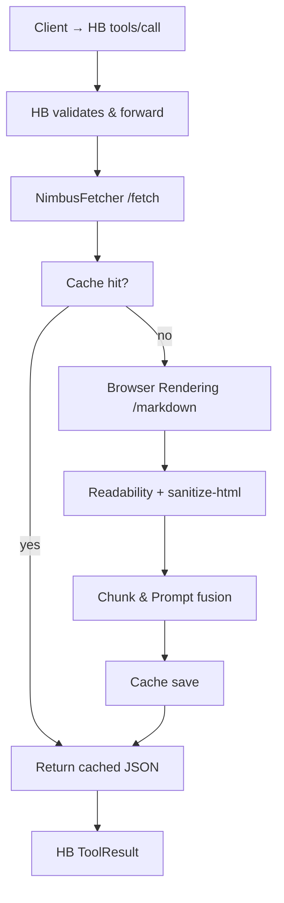

# Technical Route Reference — **NimbusFetcher** & **HermesBridge**

> Keep this file open as you code: it captures all *non‑functional* architectural choices already locked in. **Do not** diverge without explicit instruction.

---

## 1 · Stack Overview

| Layer              | Runtime / Service                                            | Key Facts                                                                                                                    |
| ------------------ | ------------------------------------------------------------ | ---------------------------------------------------------------------------------------------------------------------------- |
| **Edge compute**   | Cloudflare **Workers**                                       | 50 ms CPU default; opt‑in up to 300 000 ms. `wrangler.toml` sets `compatibility_date ≥ 2025‑07‑30` and `node_compat = true`. |
| **Rendering**      | Cloudflare **Browser Rendering** API (`/markdown` preferred) | Returns Markdown, removes boilerplate; free tier minutes then \$0.09/browser‑hour.                                           |
|                    | Playwright (CF fork)                                         | Enabled when `render_strategy = playwright`; heavier but executes SPA scripts.                                               |
| **Extraction**     | Mozilla **Readability.js**                                   | Isolate main article.                                                                                                        |
|                    | **sanitize-html**                                            | Whitelist inline tags; strips script/iframe.                                                                                 |
| **Caching**        | Cloudflare **Cache API**                                     | POST cache, key = `sha256(url + prompt)`, TTL 12 h.                                                                          |
| **Quota tracking** | **Durable Objects**                                          | Simple KV counters per client‑id.                                                                                            |

---

## 2 · Data Flow (happy path)



---

## 3 · Library & Tooling Decisions

* **TypeScript everywhere** (strict mode).
* **pnpm** as the mono‑repo package manager.
* **Vitest** for unit/integration tests.
* **ajv** (NF) / **zod** (HB) for JSON schema validation.
* **crypto.subtle.digest** for SHA‑256 in Worker.

---

## 4 · Error Code Canon

Define a shared enum in `error-codes.ts`:

```
BAD_URL | TIMEOUT | RENDER_FAIL | EMPTY_CONTENT | CACHE_ERROR | QUOTA_EXCEEDED
```

HB mirrors the same values in `isError` payloads.

---

## 5 · Security Controls

1. **SSRF guard** – Reject private IP CIDRs after DNS resolve.
2. **Resource caps** – Total fetch wall‑clock ≤15 s; max body 5 MB.
3. **Prompt hygiene** – Escape `${}`/`{{}}` before template fusion.
4. **CORS** – `Access-Control-Allow-Origin: *` not needed; only HB consumes API.

---

## 6 · Extensibility Hooks

* `render_strategy` flag already wired for future engines.
* Placeholder for Workers AI summariser (`options.summarize`).
* `HB` emits `tools/list_changed` when additional MCP tools (e.g., batch\_fetch) are registered.

---

## 7 · Quick Decision Matrix

| Decision                              | Rationale              | Change Process        |
| ------------------------------------- | ---------------------- | --------------------- |
| Use **/markdown** as default renderer | Cheapest + auto‑cleans | PR + update this file |
| Edge caching instead of R2            | No persistence needed  | Same                  |
| Single endpoint `/fetch`              | KISS; batch later      | Same                  |

---

## 8 · Core Functional Decomposition

### 8.1 NimbusFetcher (Server)

| Module             | Responsibility                                                                          |
| ------------------ | --------------------------------------------------------------------------------------- |
| **Router**         | Validate JSON, dispatch to cache/render; map HTTP ↔ internal errors                     |
| **CacheLayer**     | `caches.default` GET/PUT, TTL management, key hashing                                   |
| **Renderer**       | Choose `/markdown` or Playwright based on `render_strategy`; enforce wall‑clock timeout |
| **Extractor**      | Readability.js + sanitize-html pipeline; output clean HTML/Markdown                     |
| **Chunker**        | Estimate tokens, slice into ≤`max_tokens` chunks, add `seq` header                      |
| **PromptFusion**   | Merge system prompt + user prompt + chunk, escape template placeholders                 |
| **ErrorMapper**    | Convert thrown errors → `error.code` enumeration                                        |
| **MetricsEmitter** | Log CPU ms, render ms, cache status for Observability                                   |

### 8.2 HermesBridge (Client)

| Module              | Responsibility                                                          |
| ------------------- | ----------------------------------------------------------------------- |
| **RPCServer**       | Listen JSON‑RPC2 (`tools/list`, `tools/call`), parse/serialize messages |
| **ToolRegistry**    | Maintain tool metadata; emit `tools/list_changed` notifications         |
| **SchemaValidator** | Validate input (`zod`) + output before forwarding back to LLM           |
| **ProxyClient**     | Perform HTTPS POST to NimbusFetcher with retry & backoff                |
| **ResultMapper**    | Transform NF JSON → MCP `ToolResult`, flatten chunks to `content`       |
| **Notifier**        | Broadcast errors or new tools via MCP notifications                     |

---

## 9 · Initial Implementation Path (MVP)

> **Scope** — Build the minimum viable product capable of serving real LLM calls within one week.

### 9.1 NimbusFetcher

1. **Supported renderer** → **ONLY `/markdown`** (ignore Playwright for MVP).
2. **Cache** → in‑memory `caches.default` with hard‑coded 12 h TTL.
3. **Quota** → skip Durable Objects; rely on CF rate‑limit rules outside Worker.
4. **Chunking** → naïve splitter: `chunkSize = options.max_tokens * 4 /* char heuristic */`.
5. **PromptFusion** → template:

   ```js
   const fused = `${SYS_PROMPT}
   ```

\${userPrompt}

\${chunk}\`

```
6. **Metrics** → simple `console.log` JSON per request; no LogPush piping yet.

### 9.2 HermesBridge
1. **Tool registry** → static JSON object returned by `tools/list`.  
2. **RPC layer** → use `fastify` (lightweight) with `@fastify/rpc`.  
3. **Proxy** → node‑fetch; NF URL read from `NF_URL` env var (default `http://127.0.0.1:8787/fetch`).  
4. **Validation** → `zod` schemas compiled at start‑up; on failure return JSON‑RPC error `-32602`.  
5. **Notifications** → omit until dynamic tools exist.

### 9.3 Deliverables for MVP
| Package | Deliverable | Verification |
|---------|-------------|--------------|
| **server/** | `wrangler dev` responds to `/fetch` with cleaned Markdown chunks for `https://example.com` within 3 s | Curl test passes; JSON has ≥1 chunk |
| **client/** | `node bridge.js` → `tools/list` returns one tool; `tools/call` returns merged chunks | Vitest integration mocks NF |

All later‑stage features (Playwright, DO quota, Workers AI) remain behind feature flags and are **OUT OF SCOPE** for this milestone.

---

**End of file — treat as single source of architectural truth.**

```

